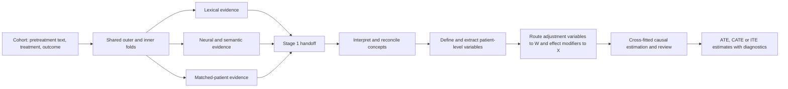

# Oncology Causal Inference (OCI)

OCI is a research codebase for finding clinically meaningful pretreatment
characteristics in longitudinal notes and using them in fold-honest causal
analyses of treatment effects and treatment-effect heterogeneity. Its primary
workflow triangulates evidence from multiple lexical, neural, semantic, and
matched-patient models in Stage 1, then uses Stage 2 to interpret that evidence,
define measurable patient variables, extract them without crossing patient or
fold boundaries, and estimate causal effects with diagnostics.

## Installation

OCI supports Python 3.12 and 3.13 and uses
[`uv`](https://docs.astral.sh/uv/) for reproducible environments. The complete
multi-model workflow requires NVIDIA CUDA GPUs; the default embedding model
needs approximately 20 GiB of free VRAM on each selected GPU. A local vLLM
server is an optional installation rather than part of the Stage 1/Stage 2
client environment.

Create the project environment with:

```bash
git clone https://github.com/kenlkehl/onc-causal-inference.git
cd onc-causal-inference
uv sync --frozen
```

An editable `pip` installation is also supported when `uv` is not desired:

```bash
pip install -e .
pip install -e ".[extraction]"  # Optional API-based extraction clients.
pip install -e ".[local-llm]"   # Optional in-process/local vLLM support.
```

When installing the `local-llm` extra, provide the system CUDA and FFmpeg
libraries required by the chosen vLLM/Torch build.

## Try the complete Stage 1 → 2 workflow

Start an OpenAI-compatible language-model server for Stage 2. The example
launcher expects it at `http://127.0.0.1:8010/v1` and automatically uses the
only model advertised by its `/models` endpoint. Then run the bundled
one-confounder, one-effect-modifier NSCLC experiment:

```bash
./run_one_conf_one_mod.sh
```

That single command synchronizes the environment, discovers visible GPUs and
their free VRAM, selects every GPU with at least 20 GiB free, sizes Stage 1 CPU
workers and Stage 2 request concurrency, and runs or resumes the complete
multi-model workflow. Results default to
`artifacts/research_all_evidence/one_conf_one_mod_nsclc_full/`.

The most useful overrides are environment variables:

```bash
# Use exactly two eligible visible GPUs.
GPU_COUNT=2 ./run_one_conf_one_mod.sh

# Use exact host GPU IDs; CUDA remaps these to logical devices for the run.
PHYSICAL_GPUS=1,3 ./run_one_conf_one_mod.sh

# Use a server on another port and bypass model autodiscovery if needed.
STAGE2_ENDPOINT=http://127.0.0.1:8010/v1 \
STAGE2_MODEL=nvidia/Gemma-4-26B-A4B-NVFP4 \
./run_one_conf_one_mod.sh
```

`GPU_COUNT` and `PHYSICAL_GPUS` are mutually exclusive. Advanced overrides are
`MIN_FREE_GPU_GB`, `STAGE1_WORKERS`, `STAGE2_WORKERS`, `DISABLE_HTR`,
`STAGE1_ARCHITECTURES`, and `STAGE2_ENDPOINT` (set it to an empty string for a
Stage-1-only run). Set
`OCI_PYTHON` to an existing environment's interpreter to skip `uv sync`. An
optional positional argument changes the output directory. The larger synthetic
example uses the identical hardware and endpoint behavior:

```bash
./run_five_conf_five_mod.sh
```

## Scientific setting

For each patient or treatment decision, OCI expects a pretreatment clinical
record, a binary treatment indicator `T`, and an observed outcome `Y`. The
estimands of interest may include an average treatment effect (ATE), a
conditional average treatment effect (CATE), or an individual-level prediction
of treatment-effect heterogeneity (ITE). In an observational study, these
estimands require substantive assumptions about consistency, positivity,
interference, measurement, and the adequacy of confounding control. Text models
do not make those assumptions true; they provide additional measurements and
diagnostics with which investigators can examine them.

OCI distinguishes two causal roles for text-derived variables:

- A **confounder** is a pretreatment characteristic needed to adjust the
  treatment comparison because it is related to both treatment assignment and
  outcome.
- An **effect modifier** is a pretreatment characteristic across which the
  treatment effect may vary. A variable may have both roles.

The all-evidence workflow does not assign these roles at the moment a word,
topic, or embedding direction is discovered. It first preserves the observable
evidence and delays role assignment until the evidence has been interpreted as
a patient-level measurement.

## The all-evidence workflow

“Stage 1” and “Stage 2” are names used by this repository for two distinct
scientific tasks. They are not generic machine-learning terms.

**Stage 1 is fold-honest feature discovery.** It fits ten complementary evidence
architectures on the permitted training rows of each outer and inner context.
The outputs are words, phrases, topics, semantic witnesses, model diagnostics,
and row-aligned numerical signals. They are evidence for hypotheses about
patient characteristics; they are not yet a final covariate matrix and they are
not treatment-effect estimates.

**Stage 2 is evidence interpretation and causal operationalization.** It reviews
the Stage 1 evidence within and across architectures, consolidates supported
clinical concepts, assigns causal roles from the types of evidence that support
each concept, defines how each variable will be measured in a complete patient
record, extracts those values, and fits the study's final causal estimator.
Stage 2 may be human-led, language-model-assisted, or a combination of the two.
The simplified runner supplies the language-model-assisted path. It sends
fold-scoped evidence to one configured OpenAI-compatible endpoint, saves the
resulting feature definitions as ordinary JSON, extracts the variables, reviews
their training-fold empirical performance, and completes cross-fitted causal
estimation. Investigators remain responsible for judging the identification
assumptions, clinical validity, overlap, and sensitivity of the resulting
estimate; the automated review is not a substitute for scientific review.



### Why the stages are separated

The separation addresses three recurring problems in causal analysis of text.
First, different representations reveal different kinds of structure: a sparse
word model is sensitive to explicit terminology, whereas an embedding model can
recognize paraphrases and a hierarchical model can use document context. Second,
model scores are not self-interpreting. A direction in embedding space can
support a concept only after readable text witnesses establish what that
direction represents. Third, feature discovery must remain inside the relevant
training fold. If held-out outcomes influence which variable is named or how it
is defined, ordinary cross-validation no longer measures the adaptive procedure.

The default five outer folds and five inner folds produce one full outer-training
context and five inner-training contexts per outer fold. All ten architectures
use the same row definitions. The outer contexts support held-out evaluation;
the inner contexts measure whether a proposed feature is stable under changes in
the discovery sample.

### How Stage 2 uses the handoff

Stage 2 receives two kinds of information. Concept-bearing evidence contains
readable words, phrases, topics, or semantic witnesses that can support the name
of a patient characteristic. Direct numerical evidence contains fitted model
outputs that may enter the final estimator or its diagnostics. Numerical values
alone are not allowed to invent a feature name.

A complete Stage 2 analysis ordinarily performs the following sequence:

1. It interprets each architecture independently so that a large or familiar
   evidence family cannot erase a smaller one.
2. It consolidates spelling variants and genuine aliases while preserving
   clinically distinct measurements.
3. It compares the resulting architecture-level dossiers and reviews the exact
   supporting evidence for proposed cross-architecture merges.
4. It routes grounded concepts to adjustment, prognostic, or treatment-effect
   heterogeneity roles according to their treatment, outcome, residual-effect,
   and matched-pair evidence.
5. It extracts the proposed variables on outer-training records and measures
   missingness, variation, nuisance-model performance, residual-effect loss,
   and leave-one-variable-out contributions by inner validation.
6. It permits a bounded clarification of the extraction definition and repeats
   training-fold evaluation when a definition changes. The final review round
   may retain or drop a variable but cannot introduce an unevaluated definition.
7. It freezes the retained definitions, applies them to the outer-held-out
   records, and fits the fold-honest nuisance and effect-modification models.
8. It combines held-out AIPW scores across outer folds to estimate the average
   treatment effect and writes row-level conditional effect estimates and
   overlap diagnostics.

This ordering is deliberate. Stage 1 discovers language patterns; Stage 2 turns
those patterns into scientific variables. Neither stage, by itself, establishes
causal identification.

## The ten Stage 1 evidence architectures

The word “architecture” refers here to a distinct way of generating scientific
evidence from text. The ten architectures are stored in three computational
components: `text_models`, `tfidf`, and `neural_queries`. The shared embedding
cache is infrastructure, and `handoff` is an aggregation step; neither is an
eleventh model.


Families 1 through 7 write their context-level evidence under
`components/text_models/`. Families 8 and 9 write under `components/tfidf/`,
and family 10 writes under `components/neural_queries/`. These locations remain
available after the combined handoff has been assembled.

The three families with `tfidf` in their names do not form one modeling branch.
Family 7 belongs to the embedding component: it provides a lexical view of both
the whole-cohort contrasts in family 5 and the cluster-local contrasts in family
6. Families 8 and 9 instead belong to an independent fold-local TF-IDF topic
pipeline that does not consume embeddings. Family 9 uses the effect-associated
n-gram inventory from that pipeline after removing terms already represented in
family 8's effect-topic bank. Thus family 7 depends on families 5 and 6, whereas
family 9 depends on the effect-topic term inventory from family 8.

### 1. Sparse treatment and outcome associations (`bow_nuisance`)

This architecture asks which words and short phrases help predict treatment
assignment or observed outcome within a training fold. It fits configured
bag-of-words or TF-IDF views, including linear and tree-based models, and records
the vocabulary associated with each prediction task. The model is intentionally
sensitive to explicit chart language such as diagnoses, performance status,
prior therapies, laboratory abnormalities, and administrative patterns.

The intuition is that a characteristic relevant to both treatment and outcome
may be important for adjustment. The output remains only a clue: a phrase may be
a proxy, a documentation habit, or a mixture of several clinical constructs.
Stage 2 must determine whether the phrase supports a measurable patient variable.

### 2. Sparse residual-effect associations (`bow_r_loss`)

The sparse residual-effect architecture searches for words and phrases related
to variation in treatment response after treatment and outcome nuisance
predictions have been accounted for. In R-learner notation, it studies the
residual relationship

```text
Y - m(X) approximately equals tau(X) times [T - e(X)],
```

where `e(X)` is the treatment model and `m(X)` is the outcome model. Terms that
help explain this residual relation are candidates for treatment-effect
heterogeneity. They are not proof that the named characteristic modifies the
treatment effect, but they provide a different signal from ordinary outcome
prediction.

### 3. Matched-patient uplift evidence (`matched_pair_uplift`)

This architecture constructs local comparisons between treated and untreated
patients who are similar according to learned nuisance structure. Sparse and
hierarchical text models then examine which features of a candidate patient and
the matched comparison are associated with differences in their observed
outcomes.

The method provides an intuitive counterfactual heuristic: it asks what differs
in the records of otherwise similar patients receiving different treatments.
Because matching can only balance measured and modeled information, the result
is evidence for a candidate characteristic rather than proof of an individual
treatment effect or its direction.

### 4. Hierarchical transformer evidence (`htr_neural`)

The hierarchical transformer divides a long record into overlapping clinical
chunks, encodes each chunk, and uses a document-level transformer to combine
them. Separate nuisance and residual-effect heads learn from the ordered chunk
representations. Attention and span summaries translate influential parts of the
record back into readable phrases.

This model is useful when meaning depends on context or on evidence distributed
across a long history. Unlike a bag-of-words model, it can distinguish some uses
of the same vocabulary and can combine information across notes. Its attention
weights should be read as model-use diagnostics, not as causal explanations.

### 5. Whole-cohort embedding contrasts (`embedding_whole_cohort`)

The embedding architecture encodes record chunks with a frozen sentence model
and averages them into patient-level semantic representations. Within each
training context, it constructs directions associated with treatment, outcome,
joint treatment-outcome structure, and residual-effect scores. It then retrieves
actual text chunks aligned with the positive and negative ends of those
directions.

This architecture can recognize semantically similar descriptions that do not
share exact words. The retrieved chunks are essential: the vector direction is a
numerical object, whereas the witnesses make it possible for a researcher to
judge whether the direction represents a coherent patient characteristic.

### 6. Cluster-local embedding contrasts (`embedding_clustered`)

Whole-cohort contrasts can be dominated by common documentation patterns. The
cluster-local architecture first groups semantically similar patient records and
then estimates contrast directions within those groups. It is intended to reveal
signals that are meaningful in a local region of the cohort but weak or
cancelled in a global average.

A cluster is a computational neighborhood, not an automatically valid disease
subtype. Stage 2 therefore interprets the retrieved witnesses without treating
cluster membership itself as a clinical label.

### 7. TF-IDF vocabulary from semantic retrieval (`tfidf_semantic_retrieval_contrasts`)

Both whole-cohort and cluster-local embedding contrasts return records or chunks
from opposing sides of a semantic direction. This architecture fits lexical
summaries to those contrasts and reports the terms that distinguish their sides.
Each result retains the identity of its parent contrast, so evidence derived from
a whole-cohort direction remains distinguishable from evidence derived from a
cluster-local direction. Family 7 is therefore a readable projection of families
5 and 6 rather than a third independent embedding model.

The terms can clarify whether an embedding direction concerns, for example,
disease burden, functional status, toxicity, or a documentation artifact. When
the vocabulary is nonspecific, the correct interpretation is to preserve that
ambiguity rather than force a clinical label.

### 8. Consensus TF-IDF topics (`tfidf_topics`)

This architecture begins independently from the fold's clinical text; it does
not use the embedding contrasts or their retrieved chunks. A fold-local TF-IDF
representation is screened separately for treatment, outcome, and
residual-effect signal. Non-negative matrix factorization is then fit across
configured random seeds to identify groups of terms that recur together.
Consensus across fits reduces dependence on a single topic decomposition.

A topic is a co-occurrence pattern, not necessarily one variable. A topic that
contains terms for frailty, oxygen use, and hospitalization may represent a
coherent severity construct, or it may combine several measurements that should
remain separate. Stage 2 reviews every topic member before naming a feature.

### 9. Residual or orphan TF-IDF n-grams (`tfidf_orphan_ngrams`)

This architecture is also independent of the embedding branch. It begins with
the effect-associated n-grams produced by the same fold-local TF-IDF screening
used for family 8 and removes every term already represented in the fitted topic
inventory for the residual-effect bank. The remaining words and short phrases
are the “orphans.” They can carry residual-effect signal even though they were
not represented by a retained topic.

This family is intentionally conservative about aggregation. A rare but precise
measurement may be scientifically important even when it does not belong to a
stable broad topic. Each retained n-gram is therefore treated as an independent
clue until the evidence supports a merge.

### 10. Learned neural-query moments (`neural_query_moments`)

Neural queries are trainable vectors that search the frozen chunk-embedding space
for recurring semantic patterns. Separate banks are optimized for treatment,
outcome, and residual-effect objectives, with constraints that encourage useful
activation and diversity among queries. The saved evidence includes query
activations, aggregate moments, and readable high-activation witnesses.

This approach is more flexible than a fixed mean-difference contrast because it
can learn several distinct semantic detectors for the same objective. Its
aggregate magnitudes remain numerical signals; the retrieved witnesses are what
permit a clinical concept to be proposed.

### What agreement and disagreement mean

Agreement across architectures increases confidence that a concept is not an
artifact of one representation. Disagreement is also informative. A lexical
model may identify an explicit laboratory term that an embedding model smooths
away, while an embedding model may recognize a concept expressed through many
paraphrases. The workflow preserves these differences for Stage 2 rather than
reducing all evidence to a global importance ranking.

## Running the all-evidence workflow

### Dataset requirements

The researcher-facing runner accepts Parquet and CSV files. A cohort should have
one row per patient or treatment decision and should contain the following
fields, although their names are configurable.

| Field | Required content |
|---|---|
| `patient_id` | This field provides a stable identifier for the unit of analysis. |
| `clinical_text` | This field contains the pretreatment clinical record used for discovery and modeling. |
| `treatment_indicator` | This field is binary, with values zero and one. |
| `outcome_indicator` | This field is binary or continuous, as declared by `outcome_type`. |
| `split` | This optional field can identify fixed `train`, `val`, and `test` partitions for standalone runs. |

Post-treatment notes should not be included when they reveal treatment response,
toxicity, or other descendants of treatment. The software can enforce fold
boundaries, but it cannot determine whether a note is temporally appropriate for
the scientific question.

### A configuration file

Copy [`example_configs/research_all_evidence.json`](example_configs/research_all_evidence.json)
and edit the dataset, output, column, and scientific settings. A typical file has
the following form:

```json
{
  "dataset": "/data/cohort.parquet",
  "output_dir": "/results/nsclc_all_evidence",
  "columns": {
    "unit_id": "patient_id",
    "text": "clinical_text",
    "treatment": "treatment_indicator",
    "outcome": "outcome_indicator"
  },
  "science": {
    "clinical_question": "Which pretreatment characteristics confound treatment selection or modify treatment effect?",
    "outcome_type": "binary",
    "outer_folds": 5,
    "inner_folds": 5,
    "seed": 42,
    "stage1": {},
    "neural_queries": {}
  },
  "models": {
    "htr": "prajjwal1/bert-tiny",
    "embeddings": "Qwen/Qwen3-Embedding-8B"
  },
  "stage2": {
    "endpoint": "",
    "model": ""
  },
  "run": {
    "mode": "stage1",
    "devices": ["cuda:0", "cuda:1"],
    "workers": 16,
    "components": [
      "embedding_cache",
      "tfidf",
      "text_models",
      "neural_queries",
      "handoff"
    ]
  }
}
```

Paths in a configuration file are resolved relative to that file. JSON and YAML
are accepted; YAML requires PyYAML. Less common model settings can be placed
under `science.stage1` or `science.neural_queries`. The resolved settings used by
the run are written beside the results.

`science.stage1_architectures` is an optional list of architecture names. When
it is omitted, the workflow preserves the existing enable-flag behavior and
runs every architecture enabled by the Stage 1 model configuration. An explicit
selection runs only the required producer components and private prerequisites,
and exposes only the selected architecture lanes to Stage 2. For example:

```bash
uv run python scripts/run_all_evidence.py \
  --config run.json \
  --architectures bow_nuisance,tfidf_topics
```

Architecture selection is part of the scientific run definition. Resume with
the same selection; use a fresh output directory to change it. `--architectures
all` explicitly selects all ten lanes.

Chunk-based models fail rather than silently discard the end of an unusually
long record. If a capacity error reports that a record requires more embedding
chunks, the limit can be increased without editing the base template. For
example, `--set science.stage1.architecture.multi_model_forest.embedding_contrast.max_chunks=128`
sets a nonbinding capacity for records that require no more than 128 chunks.

Start or resume the run with one command:

```bash
uv run python scripts/run_all_evidence.py --config run.json
```

`scripts/run_all_evidence.py` orchestrates the complete multi-model Stage 1 and
Stage 2 workflow. Fold-local BoW, HTR, embedding, matched-pair, and
structured-effect settings live under
`science.stage1.architecture.multi_model_forest`.

The same program accepts direct arguments when a separate configuration file is
not useful. The following command defines an equivalent Stage 1 run explicitly:

```bash
uv run python scripts/run_all_evidence.py \
  --dataset /data/cohort.parquet \
  --output-dir /results/nsclc_all_evidence \
  --unit-id-column patient_id \
  --text-column clinical_text \
  --treatment-column treatment_indicator \
  --outcome-column outcome_indicator \
  --outcome-type binary \
  --clinical-question "Which pretreatment characteristics confound treatment selection or modify treatment effect?" \
  --outer-folds 5 \
  --inner-folds 5 \
  --devices cuda:0,cuda:1 \
  --workers 16 \
  --stage1-only
```

The bundled one-confounder, one-effect-modifier NSCLC example can also write to
an explicit output directory:

```bash
./run_one_conf_one_mod.sh /persistent/results/nsclc_example
```

### Parallel execution

The workflow runs its top-level components in order because later components
reuse artifacts or split definitions produced by earlier ones. Parallelism is
applied within the computationally expensive components. The embedding cache
divides the ordered chunk corpus among the configured GPUs. TF-IDF discovery
uses separate CPU processes across independent outer/full and exact-inner
contexts. Each process performs one context's vectorization, screening,
stability analysis, and topic fitting with one native numerical thread. This
process boundary is important because several parts of topic discovery are
Python-heavy and would contend if they shared one interpreter. The number of
simultaneous context processes is the smaller of the unfinished context count
and `run.workers`. The text-model and neural-query components also treat each
outer/full or exact-inner discovery context as an independent job.

Thread pools are retained where they have different semantics: concurrent
endpoint requests, work assigned to distinct GPU devices, and nested
scikit-learn fits inside an already isolated text-model process. These tasks
either wait on I/O, execute outside the Python interpreter, or avoid the memory
cost and instability of nested process pools. Python-heavy TF-IDF context work
does not use the thread backend by default.

For CUDA runs, the runner creates one fixed process lane per configured GPU and
assigns whole contexts to those lanes. A lane remains attached to the same GPU,
which prevents two contexts from being scheduled onto one device merely because
another device finished early. The number of active lanes is the smaller of the
number of configured CUDA devices and the number of unfinished contexts. The
runner assigns the largest contexts first to the currently least-loaded lane.

During `text_models`, the total CPU budget is divided as evenly as possible
among the active lanes. If the division has a remainder, the first lanes receive
one additional worker. Within a lane, independent BoW cross-fitting folds and
the treatment, outcome, and effect-importance fits use up to that lane's worker
allocation as threads. The native numerical libraries remain single-threaded
within each fit, which prevents nested work from exceeding the stated CPU
budget. A neural-query context uses its assigned GPU for its inner-fold fits,
final query banks, and evidence retrieval; its parallelism occurs across
contexts rather than by oversubscribing the device within a context.

The `run.devices` setting determines GPU-lane concurrency. `run.workers` is the
overall CPU budget used by TF-IDF and divided among the concurrently active
text-model lanes. If fewer workers than CUDA devices are requested, each active
device still requires one controller worker. Stage 2 uses its own
`stage2.workers` setting for concurrent interpretation requests and
patient-extraction batches. Review rounds and outer folds remain ordered so that
a single endpoint is never multiplied by two independent concurrency limits.
Every Stage 1 context and every expensive Stage 2 batch writes its own
`complete.json`, so the same scheduling remains resumable after interruption.

### Stage-specific execution

An empty Stage 2 endpoint means that the workflow stops after Stage 1. This is
useful when a researcher wishes to inspect the discovery evidence before
permitting any variables to enter the causal analysis.

```bash
uv run python scripts/run_all_evidence.py --config run.json --stage1-only
```

When a Stage 2 endpoint has been configured, the same entry point can run the
complete second stage against an existing handoff:

```bash
OPENBLAS_NUM_THREADS=1 \
OMP_NUM_THREADS=1 \
MKL_NUM_THREADS=1 \
NUMEXPR_NUM_THREADS=1 \
uv run python scripts/run_all_evidence.py \
  --config run.json \
  --stage2-only \
  --stage2-endpoint http://127.0.0.1:8010/v1
```

Set these thread limits before starting Python on high-core-count machines.
Stage 2 already controls request concurrency with `stage2.workers`; allowing
OpenBLAS, OpenMP, MKL, or NumExpr to create another native thread pool per
concurrent task can exhaust OpenBLAS's thread metadata or memory regions and
terminate the process. A configured `stage2.model` is reused; otherwise the
runner discovers the sole model advertised by the endpoint.

A configured endpoint makes the unflagged default a full Stage 1 and Stage 2
run. The API key may be stored in `stage2.api_key` or supplied through
`OCI_STAGE2_API_KEY`. For example:

```json
{
  "stage2": {
    "endpoint": "http://127.0.0.1:8010/v1",
    "model": "Qwen/Qwen3-32B",
    "workers": 8,
    "request_timeout": 7200,
    "evidence_compiler": "semantic_cluster_cards_v2",
    "evidence_max_cards_per_fold": 400,
    "evidence_max_exemplars_per_card": 4,
    "evidence_max_exemplar_chars": 2400,
    "max_review_rounds": 2,
    "estimation_trees": 200
  },
  "run": {
    "mode": "full"
  }
}
```

`stage2.model` is optional. When it is empty or omitted, Stage 2 queries the
endpoint's OpenAI-compatible `/models` API and uses the advertised model if
exactly one model ID is returned. Configure `stage2.model` explicitly when the
endpoint advertises multiple IDs.

Stage 2 extraction is permanently isolated to one patient per model prompt.
Concurrency is controlled by `stage2.workers`; patient batching is not configurable.

Stage 2 preserves the outer-fold boundary throughout variable construction and
estimation. Before the first LLM request, its default evidence compiler reuses
the scientific allowlisting in `all_evidence_fusion`, removes exact duplicates
with provenance retained, and builds a conservative fold-local semantic-card
atlas. Compatible clinical chunks reuse the existing Stage 1 embedding cache by
memory map; other evidence uses deterministic lexical projections, so this step
does not load another embedding model beside the serving process. The raw Stage
1 evidence remains unchanged, while cards, exact members, lineage, and a
reduction audit are written under `stage2/evidence_compilation/`. The compiled
packet plan is cached and input-fingerprinted for fast, safe restarts.

`semantic_cluster_cards_v2` is the only supported Stage 2 evidence compiler.
Before any interpretation request, it compares the architectures present in
each outer fold with the run's frozen Stage 1 selection: either the explicit
selector or, for legacy runs, the resolved enable flags. A missing selected
architecture stops with a direct instruction to rerun its Stage 1 component and
rebuild the handoff. This is a local
scientific completeness check; it does not introduce artifact authentication,
bundle attestation, checkpoint adoption, or deployment gates. The former
`raw_packets_v1` option was retired because it merged distinct architectures
into broad prompt buckets.

Stage 2 then interprets the compiled evidence architectures and consolidates
the result into operational patient-level definitions. Consolidation uses
generic fuzzy blocking followed by independent LLM alias judgments, then one
name-only global pass for residual synonym merges. Python deterministically
carries supporting packets, architectures, evidence axes, causal roles, and
original-candidate dispositions through those groups. There is no feature-count
selection step. Finally, independent one-feature requests receive only the
canonical feature name and a deduplicated flat list of readable supporting-text
strings. The model decides the value type, units or allowed categories,
measurement rule, and missingness handling from that evidence; packet structure,
evidence kind, detail objects, truncation flags, fold metadata, internal IDs,
causal axes, semantic grouping, architecture names, scores, support counts,
candidate summaries, and earlier proposed value types stay outside the prompt.
Consolidation and every one-group
operationalization request are input-fingerprinted separately, so a retry skips
successful leaves instead of repeating the whole fan-out. It then extracts the variables on the outer
training rows and measures missingness, variation,
treatment prediction, outcome prediction, and residual-effect performance by
inner validation. Leave-one-feature-out measurements show whether each variable
improves or degrades those metrics relative to the complete extracted feature
set. The language model may revise an extraction definition and repeat this
training-fold evaluation for at most `max_review_rounds`. In the last round it
may retain or drop a variable but may not introduce an unevaluated measurement
definition.

Only after this review has ended is the final definition applied to the outer
held-out records. Nuisance models for treatment and potential outcomes are fit
without using those held-out outcomes. The fold result contains held-out
propensities, potential-outcome predictions, AIPW scores, and conditional effect
estimates. Combining the held-out rows across outer folds produces the final
average treatment effect and its confidence interval.


### Output and interruption recovery

The output directory is both the result location and the resumable checkpoint.
There is no separate run registry or resume token.

```text
nsclc_all_evidence/
  run_config.json
  resolved_stage1_model_config.json
  resolved_neural_query_config.json
  progress.json
  logs/
    workflow.log
  components/
    embedding_cache/
      cache/...
      complete.json
    tfidf/
      predictions.parquet
      split_provenance.jsonl
      evidence.jsonl
      stage1_tfidf_topics/contexts/...
      complete.json
    text_models/
      outer_001_full/...
      outer_001_inner_001/...
      evidence.jsonl
      complete.json
    neural_queries/
      outer_001_full/...
      outer_001_inner_001/...
      evidence.jsonl
      complete.json
  stage1_architectures/
    manifest.json
    bow_nuisance/evidence.jsonl
    ...
  handoff/
    text_models.jsonl
    tfidf.jsonl
    neural_queries.jsonl
    evidence.jsonl
    index.json
    complete.json
  evaluations/
    stage1/
      evaluation_manifest.json
      metrics.jsonl
      comparison.csv
      summary.json
      architectures/.../metrics.jsonl
  stage2/
    config.json
    outer_001/
      interpretations/...
      feature_definitions.json
      review/
        round_001/
          extraction/extracted.csv
          extraction_summary.json
          performance.json
          review.json
          complete.json
      final_definitions.json
      extraction/
        heldout/extracted.csv
        extracted_features.csv
      estimation/
        predictions.csv
        diagnostics.json
        complete.json
      complete.json
    features_by_outer_fold.jsonl
    cross_fitted_predictions.csv
    posthoc_predictions_with_oracle_ite.csv
    posthoc_oracle_ite_metrics.json
    causal_estimate.json
    summary.json
    complete.json
```

`progress.json` provides the current component and status. The workflow log is
written to `logs/workflow.log`, and model-specific intermediate results are kept
under `components/<name>/`. Stage 2's intermediate scientific results are under
the current `stage2/outer_NNN/` directory: this is the direct place to inspect
the variables, extraction summaries, performance measurements, and fold-level
estimates. If a process is interrupted, rerunning the same command skips each
completed interpretation batch, extraction batch, review round, and fold
estimate, then re-enters the first incomplete directory.

When the input dataset contains `true_ite_prob`, Stage 2 evaluates its frozen
cross-fitted `estimated_cate` values against that oracle only after all modeling
is complete. `causal_estimate.json` reports the overall Pearson and Spearman ITE
correlations, while `posthoc_oracle_ite_metrics.json` adds error, dispersion,
ATE-bias, and per-fold diagnostics. The frozen prediction file remains
oracle-free; the joined audit data is written separately to
`posthoc_predictions_with_oracle_ite.csv`. For real datasets without an oracle,
the metrics file records that the evaluation is unavailable.

The stable boundary between the stages is `handoff/evidence.jsonl`.
`handoff/index.json` identifies the contributing files, and the uncombined
per-component JSONL files remain beside it. Python consumers can stream the
combined handoff without loading it into memory:

```python
from oci.inference.research_all_evidence_workflow import iter_stage1_handoff

for evidence_context in iter_stage1_handoff("/results/nsclc_all_evidence"):
    process(evidence_context)
```

The additive `stage1_architectures/` contract is the architecture-oriented
view of the same frozen evidence. Its manifest records the selected lanes,
private support services, producer artifacts, hashes, and row-score sidecars.
Targeted runs use these canonical envelopes as the handoff itself; legacy runs
retain their existing component handoff and receive the sidecars additively.

To inspect status without starting work, use `--status`. To intentionally rerun
a component, use `--rerun COMPONENT`. This removes completion markers but leaves
the model files in place. A scientifically different configuration should use a
new output directory because the simplified runner deliberately does not compare
or invalidate prior settings.

When a Stage 1 text producer changes, rerun both `text_models` and `handoff`;
the existing TF-IDF and neural-query components can remain complete. Before
starting Stage 2 from that changed handoff, move the old `stage2/` directory to
an audit backup (or choose a new output directory). Stage 2 intentionally rejects
old feature-definition checkpoints whose evidence fingerprint no longer matches.

The complete operational reference is
[`docs/all_evidence_workflow.md`](docs/all_evidence_workflow.md),
and the abbreviated command reference is
[`docs/all_evidence_quickstart.md`](docs/all_evidence_quickstart.md).

## Standalone explicit-feature workflows

Explicit-feature functionality remains available for investigator-specified
measurements and adaptive feature discovery. These workflows share the same
role-aware feature contracts used by the all-evidence pipeline.

| Model type | Purpose |
|---|---|
| `explicit_feature_forest` | Extract a fixed set of investigator-defined variables, route confounders to `W` and effect modifiers to `X`, and fit the retained causal-forest estimator. |
| `agentic_explicit_feature_forest` | Propose and evaluate explicit variables within nested cross-validation. |
| `agentic_attention_variable_forest` | Use retained HTR evidence to support explicit-variable discovery and adequacy review. |
| `multi_model_agentic_forest` | Combine sparse, HTR, and embedding evidence before explicit-variable extraction. |

A standalone explicit-feature configuration can be initialized and run with:

```bash
oci init --output config.json
oci run --config config.json --device cuda:0 --workers 4
```

See
[`example_configs/agentic_explicit_feature_forest_config.json`](example_configs/agentic_explicit_feature_forest_config.json)
for the complete role-aware extraction contract. The retired DragonNet,
single-representation neural heads, experimental CNN/GRU/slot extractors, and
standalone TF-IDF wrapper are no longer shipped; their scientific counterparts
are represented by the ten independently evaluable Stage 1 architectures.

## Synthetic data and Stage 1 architecture evaluation

The `synthetic_data/` package creates clinical narratives with known confounders,
effect modifiers, treatment equations, outcome equations, and ground-truth
treatment effects. It can also generate encounters, diagnosis and procedure
codes, laboratory results, hospitalizations, and patient-reported outcomes,
rendered into a chronological text record. These datasets support recovery and
calibration studies that would not be possible with unidentified real-world
ground truth.

```bash
python -m synthetic_data.cli \
  --use-vllm-batch \
  --dataset-size 500 \
  --structured-data \
  --output-dir ./my_synthetic_data
```

Oracle truth is never supplied to Stage 1. After a Stage 1 handoff has been
completed and frozen, evaluate each architecture independently against a
synthetic dataset's known variables and treatment effects:

```bash
uv run oci-evaluate-stage1 \
  --run-dir /results/nsclc_all_evidence \
  --metadata /data/synthetic/metadata.json \
  --architectures all
```

The evaluator reads saved per-architecture evidence and held-out row-score
sidecars; it never refits or selects a Stage 1 model. It hashes those artifacts
before loading oracle-bearing columns, then writes common recovery metrics and
architecture-native metrics under `evaluations/stage1/`. Each architecture has
its own metrics file, while `comparison.csv` provides a common cross-lane view.
Use a comma-separated subset to evaluate only lanes present in the run:

| Architecture | Native evaluation emphasis |
|---|---|
| `bow_nuisance` | Held-out treatment/outcome nuisance performance and treatment/outcome evidence balance |
| `bow_r_loss` | Normalized held-out R-loss gain and residual-effect evidence coverage |
| `matched_pair_uplift` | Positive-match coverage, pair-side representation, and uplift association |
| `htr_neural` | Held-out nuisance/R-loss behavior, represented HTR stages, and witness-patient coverage |
| `embedding_whole_cohort` | Contrast and polarity coverage, semantic witnesses, and oracle-feature association |
| `embedding_clustered` | Cluster-local contrast coverage and cluster representation |
| `tfidf_semantic_retrieval_contrasts` | Parent-contrast coverage and recovered lexical evidence |
| `tfidf_topics` | Topic count, treatment/outcome/effect bank coverage, and inner-fold stability |
| `tfidf_orphan_ngrams` | Orphan-cluster coverage, lexical recovery, and inner-fold stability |
| `neural_query_moments` | Query and bank coverage, witness-patient coverage, activation association, and stability |

```bash
uv run oci-evaluate-stage1 \
  --run-dir /results/nsclc_all_evidence \
  --architectures htr_neural,neural_query_moments
```

Older runs with only `handoff/evidence.jsonl` are backfilled into the same
architecture artifact contract without rerunning Stage 1. The reusable
semi-synthetic data-generating process lives in
`synthetic_data/semisynthetic_dgp.py`; one-off architecture-specific oracle
launchers have been retired.

## Interpreting results

Standalone runs ordinarily write `predictions.parquet` under
`output_dir/applied_inference/`. Depending on the estimator, it may contain
predicted potential outcomes, propensity scores, treatment-effect estimates,
and confidence limits.

| Column | Meaning |
|---|---|
| `pred_y0_prob` | This is the predicted outcome probability under control. |
| `pred_y1_prob` | This is the predicted outcome probability under treatment. |
| `pred_ite_prob` | This is the difference between the two predicted outcome probabilities. |
| `pred_propensity_prob` | This is the estimated probability of receiving treatment. |
| `pred_ite_lower` | This is the lower interval bound when the estimator provides forest inference. |
| `pred_ite_upper` | This is the corresponding upper interval bound. |

Predictive accuracy, nuisance-model discrimination, R-loss, overlap, calibration,
and stability across folds should be examined together. A narrow interval around
a biased estimand is not evidence of causal validity. Investigators should also
inspect whether discovered variables are pretreatment, well measured, clinically
coherent, and supported in both treatment groups.

## Further documentation

The simplified workflow should be the starting point for new research runs. The
following documents provide additional detail:

- [`docs/all_evidence_workflow.md`](docs/all_evidence_workflow.md)
  describes configuration, stage-specific execution, output paths, and resume
  behavior.
- [`docs/all_evidence_quickstart.md`](docs/all_evidence_quickstart.md)
  provides a short command reference.

The former authenticated production control plane has been removed. New and
resumed runs use `scripts/run_all_evidence.py` and the ordinary files described
above.

## Dependencies

The principal dependencies are PyTorch, Transformers, Sentence Transformers,
pandas, NumPy, SciPy, scikit-learn, econml, PyArrow, Accelerate, and the OpenAI
client used for Stage 2 endpoints. Local vLLM and OpenAI Harmony are isolated in
the `local-llm` extra; Google extraction credentials are in `extraction`.

## Citation

```bibtex
@software{oci2024,
  author = {Kehl, Ken},
  title = {Oncology Causal Inference: Treatment Effect Estimation from Clinical Text},
  year = {2024},
  url = {https://github.com/kenlkehl/onc-causal-inference}
}
```

## License

OCI is distributed under the MIT License. See [`LICENSE`](LICENSE) for the full
text.
