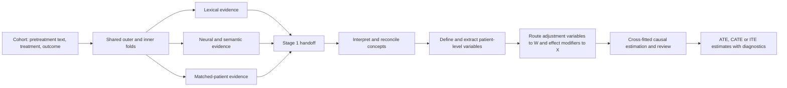
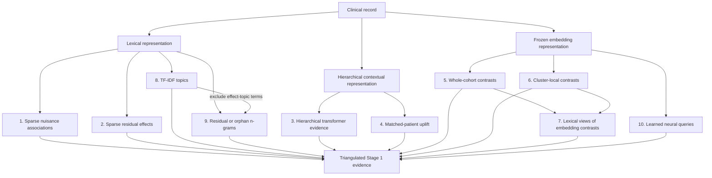
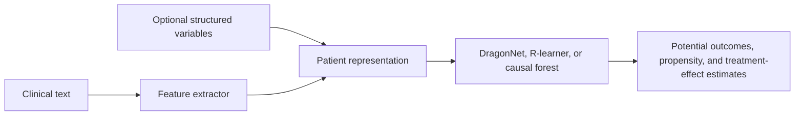

# Oncology Causal Inference (OCI)

OCI is a research codebase for studying treatment-effect heterogeneity in
longitudinal clinical text. It is designed for observational settings in which
important pretreatment characteristics are described in notes but are absent,
incomplete, or coarsely represented in structured data.

The central methodological problem is not simply to predict treatment or
outcome from text. A term can be highly predictive without identifying a
well-defined patient characteristic, and a predictive characteristic does not
automatically have a causal role. OCI therefore separates feature discovery
from causal estimation. Its all-evidence workflow first asks several different
text models what the cohort appears to contain. A subsequent stage interprets
that evidence, defines measurable patient variables, and uses those variables
in a fold-honest causal analysis.

This repository also contains standalone neural and non-neural treatment-effect
models. Those models are useful for benchmarking and focused experiments, but
they should not be confused with the all-evidence workflow described below.

## Scientific setting

For each patient or treatment decision, OCI expects a pretreatment clinical
record, a binary treatment indicator `T`, and an observed outcome `Y`. The
estimands of interest may include an average treatment effect (ATE), a
conditional average treatment effect (CATE), or an individual-level prediction
of treatment-effect heterogeneity (ITE). In an observational study, these
estimands require substantive assumptions about consistency, positivity,
interference, measurement, and the adequacy of confounding control. Text models
do not make those assumptions true; they provide additional measurements and
diagnostics with which investigators can examine them.

OCI distinguishes two causal roles for text-derived variables:

- A **confounder** is a pretreatment characteristic needed to adjust the
  treatment comparison because it is related to both treatment assignment and
  outcome.
- An **effect modifier** is a pretreatment characteristic across which the
  treatment effect may vary. A variable may have both roles.

The all-evidence workflow does not assign these roles at the moment a word,
topic, or embedding direction is discovered. It first preserves the observable
evidence and delays role assignment until the evidence has been interpreted as
a patient-level measurement.

## The all-evidence workflow

“Stage 1” and “Stage 2” are names used by this repository for two distinct
scientific tasks. They are not generic machine-learning terms.

**Stage 1 is fold-honest feature discovery.** It fits ten complementary evidence
architectures on the permitted training rows of each outer and inner context.
The outputs are words, phrases, topics, semantic witnesses, model diagnostics,
and row-aligned numerical signals. They are evidence for hypotheses about
patient characteristics; they are not yet a final covariate matrix and they are
not treatment-effect estimates.

**Stage 2 is evidence interpretation and causal operationalization.** It reviews
the Stage 1 evidence within and across architectures, consolidates supported
clinical concepts, assigns causal roles from the types of evidence that support
each concept, defines how each variable will be measured in a complete patient
record, extracts those values, and fits the study's final causal estimator.
Stage 2 may be human-led, language-model-assisted, or a combination of the two.
Because those decisions depend on the study question and governance setting,
the simplified runner treats Stage 2 as a configured study-specific command.



### Why the stages are separated

The separation addresses three recurring problems in causal analysis of text.
First, different representations reveal different kinds of structure: a sparse
word model is sensitive to explicit terminology, whereas an embedding model can
recognize paraphrases and a hierarchical model can use document context. Second,
model scores are not self-interpreting. A direction in embedding space can
support a concept only after readable text witnesses establish what that
direction represents. Third, feature discovery must remain inside the relevant
training fold. If held-out outcomes influence which variable is named or how it
is defined, ordinary cross-validation no longer measures the adaptive procedure.

The default five outer folds and five inner folds produce one full outer-training
context and five inner-training contexts per outer fold. All ten architectures
use the same row definitions. The outer contexts support held-out evaluation;
the inner contexts measure whether a proposed feature is stable under changes in
the discovery sample.

### How Stage 2 uses the handoff

Stage 2 receives two kinds of information. Concept-bearing evidence contains
readable words, phrases, topics, or semantic witnesses that can support the name
of a patient characteristic. Direct numerical evidence contains fitted model
outputs that may enter the final estimator or its diagnostics. Numerical values
alone are not allowed to invent a feature name.

A complete Stage 2 analysis ordinarily performs the following sequence:

1. It interprets each architecture independently so that a large or familiar
   evidence family cannot erase a smaller one.
2. It consolidates spelling variants and genuine aliases while preserving
   clinically distinct measurements.
3. It compares the resulting architecture-level dossiers and reviews the exact
   supporting evidence for proposed cross-architecture merges.
4. It routes grounded concepts to adjustment, prognostic, or treatment-effect
   heterogeneity roles according to their treatment, outcome, residual-effect,
   and matched-pair evidence.
5. It freezes a patient-level extraction definition, including the measurement,
   unit or categories, aliases, and handling of missing or ambiguous text.
6. It extracts values from complete records, evaluates their empirical adequacy,
   and fits the final fold-honest causal model.

This ordering is deliberate. Stage 1 discovers language patterns; Stage 2 turns
those patterns into scientific variables. Neither stage, by itself, establishes
causal identification.

## The ten Stage 1 evidence architectures

The word “architecture” refers here to a distinct way of generating scientific
evidence from text. The ten architectures are stored in three computational
components: `text_models`, `tfidf`, and `neural_queries`. The shared embedding
cache is infrastructure, and `handoff` is an aggregation step; neither is an
eleventh model.



Families 1 through 7 write their context-level evidence under
`components/text_models/`. Families 8 and 9 write under `components/tfidf/`,
and family 10 writes under `components/neural_queries/`. These locations remain
available after the combined handoff has been assembled.

The three families with `tfidf` in their names do not form one modeling branch.
Family 7 belongs to the embedding component: it provides a lexical view of both
the whole-cohort contrasts in family 5 and the cluster-local contrasts in family
6. Families 8 and 9 instead belong to an independent fold-local TF-IDF topic
pipeline that does not consume embeddings. Family 9 uses the effect-associated
n-gram inventory from that pipeline after removing terms already represented in
family 8's effect-topic bank. Thus family 7 depends on families 5 and 6, whereas
family 9 depends on the effect-topic term inventory from family 8.

### 1. Sparse treatment and outcome associations (`bow_nuisance`)

This architecture asks which words and short phrases help predict treatment
assignment or observed outcome within a training fold. It fits configured
bag-of-words or TF-IDF views, including linear and tree-based models, and records
the vocabulary associated with each prediction task. The model is intentionally
sensitive to explicit chart language such as diagnoses, performance status,
prior therapies, laboratory abnormalities, and administrative patterns.

The intuition is that a characteristic relevant to both treatment and outcome
may be important for adjustment. The output remains only a clue: a phrase may be
a proxy, a documentation habit, or a mixture of several clinical constructs.
Stage 2 must determine whether the phrase supports a measurable patient variable.

### 2. Sparse residual-effect associations (`bow_r_loss`)

The sparse residual-effect architecture searches for words and phrases related
to variation in treatment response after treatment and outcome nuisance
predictions have been accounted for. In R-learner notation, it studies the
residual relationship

```text
Y - m(X) approximately equals tau(X) times [T - e(X)],
```

where `e(X)` is the treatment model and `m(X)` is the outcome model. Terms that
help explain this residual relation are candidates for treatment-effect
heterogeneity. They are not proof that the named characteristic modifies the
treatment effect, but they provide a different signal from ordinary outcome
prediction.

### 3. Hierarchical transformer evidence (`htr_neural`)

The hierarchical transformer divides a long record into overlapping clinical
chunks, encodes each chunk, and uses a document-level transformer to combine
them. Separate nuisance and residual-effect heads learn from the ordered chunk
representations. Attention and span summaries translate influential parts of the
record back into readable phrases.

This model is useful when meaning depends on context or on evidence distributed
across a long history. Unlike a bag-of-words model, it can distinguish some uses
of the same vocabulary and can combine information across notes. Its attention
weights should be read as model-use diagnostics, not as causal explanations.

### 4. Matched-patient uplift evidence (`matched_pair_uplift`)

This architecture constructs local comparisons between treated and untreated
patients who are similar according to learned nuisance structure. Sparse and
hierarchical text models then examine which features of a candidate patient and
the matched comparison are associated with differences in their observed
outcomes.

The method provides an intuitive counterfactual heuristic: it asks what differs
in the records of otherwise similar patients receiving different treatments.
Because matching can only balance measured and modeled information, the result
is evidence for a candidate characteristic rather than proof of an individual
treatment effect or its direction.

### 5. Whole-cohort embedding contrasts (`embedding_whole_cohort`)

The embedding architecture encodes record chunks with a frozen sentence model
and averages them into patient-level semantic representations. Within each
training context, it constructs directions associated with treatment, outcome,
joint treatment-outcome structure, and residual-effect scores. It then retrieves
actual text chunks aligned with the positive and negative ends of those
directions.

This architecture can recognize semantically similar descriptions that do not
share exact words. The retrieved chunks are essential: the vector direction is a
numerical object, whereas the witnesses make it possible for a researcher to
judge whether the direction represents a coherent patient characteristic.

### 6. Cluster-local embedding contrasts (`embedding_clustered`)

Whole-cohort contrasts can be dominated by common documentation patterns. The
cluster-local architecture first groups semantically similar patient records and
then estimates contrast directions within those groups. It is intended to reveal
signals that are meaningful in a local region of the cohort but weak or
cancelled in a global average.

A cluster is a computational neighborhood, not an automatically valid disease
subtype. Stage 2 therefore interprets the retrieved witnesses without treating
cluster membership itself as a clinical label.

### 7. TF-IDF vocabulary from semantic retrieval (`tfidf_semantic_retrieval_contrasts`)

Both whole-cohort and cluster-local embedding contrasts return records or chunks
from opposing sides of a semantic direction. This architecture fits lexical
summaries to those contrasts and reports the terms that distinguish their sides.
Each result retains the identity of its parent contrast, so evidence derived from
a whole-cohort direction remains distinguishable from evidence derived from a
cluster-local direction. Family 7 is therefore a readable projection of families
5 and 6 rather than a third independent embedding model.

The terms can clarify whether an embedding direction concerns, for example,
disease burden, functional status, toxicity, or a documentation artifact. When
the vocabulary is nonspecific, the correct interpretation is to preserve that
ambiguity rather than force a clinical label.

### 8. Consensus TF-IDF topics (`tfidf_topics`)

This architecture begins independently from the fold's clinical text; it does
not use the embedding contrasts or their retrieved chunks. A fold-local TF-IDF
representation is screened separately for treatment, outcome, and
residual-effect signal. Non-negative matrix factorization is then fit across
configured random seeds to identify groups of terms that recur together.
Consensus across fits reduces dependence on a single topic decomposition.

A topic is a co-occurrence pattern, not necessarily one variable. A topic that
contains terms for frailty, oxygen use, and hospitalization may represent a
coherent severity construct, or it may combine several measurements that should
remain separate. Stage 2 reviews every topic member before naming a feature.

### 9. Residual or orphan TF-IDF n-grams (`tfidf_orphan_ngrams`)

This architecture is also independent of the embedding branch. It begins with
the effect-associated n-grams produced by the same fold-local TF-IDF screening
used for family 8 and removes every term already represented in the fitted topic
inventory for the residual-effect bank. The remaining words and short phrases
are the “orphans.” They can carry residual-effect signal even though they were
not represented by a retained topic.

This family is intentionally conservative about aggregation. A rare but precise
measurement may be scientifically important even when it does not belong to a
stable broad topic. Each retained n-gram is therefore treated as an independent
clue until the evidence supports a merge.

### 10. Learned neural-query moments (`neural_query_moments`)

Neural queries are trainable vectors that search the frozen chunk-embedding space
for recurring semantic patterns. Separate banks are optimized for treatment,
outcome, and residual-effect objectives, with constraints that encourage useful
activation and diversity among queries. The saved evidence includes query
activations, aggregate moments, and readable high-activation witnesses.

This approach is more flexible than a fixed mean-difference contrast because it
can learn several distinct semantic detectors for the same objective. Its
aggregate magnitudes remain numerical signals; the retrieved witnesses are what
permit a clinical concept to be proposed.

### What agreement and disagreement mean

Agreement across architectures increases confidence that a concept is not an
artifact of one representation. Disagreement is also informative. A lexical
model may identify an explicit laboratory term that an embedding model smooths
away, while an embedding model may recognize a concept expressed through many
paraphrases. The workflow preserves these differences for Stage 2 rather than
reducing all evidence to a global importance ranking.

## Running the all-evidence workflow

### Installation

OCI supports Python 3.12 and 3.13. A CUDA-capable GPU is required for the neural
and embedding models, although the TF-IDF models can run on CPUs.

```bash
git clone https://github.com/kenlkehl/onc-causal-inference.git
cd onc-causal-inference
uv sync --frozen
```

An editable `pip` installation is also supported:

```bash
pip install -e .
pip install -e ".[extraction]"  # This adds optional API-based extraction clients.
```

TorchCodec requires shared FFmpeg libraries. On Debian or Ubuntu, a missing
`libavutil` error can be resolved with `sudo apt-get install ffmpeg`. The
committed eight-GPU example launcher performs this check before it starts.

### Dataset requirements

The researcher-facing runner accepts Parquet and CSV files. A cohort should have
one row per patient or treatment decision and should contain the following
fields, although their names are configurable.

| Field | Required content |
|---|---|
| `patient_id` | This field provides a stable identifier for the unit of analysis. |
| `clinical_text` | This field contains the pretreatment clinical record used for discovery and modeling. |
| `treatment_indicator` | This field is binary, with values zero and one. |
| `outcome_indicator` | This field is binary or continuous, as declared by `outcome_type`. |
| `split` | This optional field can identify fixed `train`, `val`, and `test` partitions for standalone runs. |

Post-treatment notes should not be included when they reveal treatment response,
toxicity, or other descendants of treatment. The software can enforce fold
boundaries, but it cannot determine whether a note is temporally appropriate for
the scientific question.

### A configuration file

Copy [`example_configs/research_all_evidence.json`](example_configs/research_all_evidence.json)
and edit the dataset, output, column, and scientific settings. A typical file has
the following form:

```json
{
  "dataset": "/data/cohort.parquet",
  "output_dir": "/results/nsclc_all_evidence",
  "columns": {
    "unit_id": "patient_id",
    "text": "clinical_text",
    "treatment": "treatment_indicator",
    "outcome": "outcome_indicator"
  },
  "science": {
    "clinical_question": "Which pretreatment characteristics confound treatment selection or modify treatment effect?",
    "outcome_type": "binary",
    "outer_folds": 5,
    "inner_folds": 5,
    "seed": 42,
    "stage1": {},
    "neural_queries": {}
  },
  "models": {
    "htr": "prajjwal1/bert-tiny",
    "embeddings": "Qwen/Qwen3-Embedding-8B"
  },
  "stage2": {
    "command": []
  },
  "run": {
    "mode": "stage1",
    "devices": ["cuda:0", "cuda:1"],
    "workers": 16,
    "components": [
      "embedding_cache",
      "tfidf",
      "text_models",
      "neural_queries",
      "handoff"
    ]
  }
}
```

Paths in a configuration file are resolved relative to that file. JSON and YAML
are accepted; YAML requires PyYAML. Less common model settings can be placed
under `science.stage1` or `science.neural_queries`. The resolved settings used by
the run are written beside the results.

Chunk-based models fail rather than silently discard the end of an unusually
long record. If a capacity error reports that a record requires more embedding
chunks, the limit can be increased without editing the base template. For
example, `--set science.stage1.architecture.multi_model_forest.embedding_contrast.max_chunks=128`
sets a nonbinding capacity for records that require no more than 128 chunks.

Start or resume the run with one command:

```bash
uv run python scripts/run_all_evidence.py --config run.json
```

The same program accepts direct arguments when a separate configuration file is
not useful. The following command defines an equivalent Stage 1 run explicitly:

```bash
uv run python scripts/run_all_evidence.py \
  --dataset /data/cohort.parquet \
  --output-dir /results/nsclc_all_evidence \
  --unit-id-column patient_id \
  --text-column clinical_text \
  --treatment-column treatment_indicator \
  --outcome-column outcome_indicator \
  --outcome-type binary \
  --clinical-question "Which pretreatment characteristics confound treatment selection or modify treatment effect?" \
  --outer-folds 5 \
  --inner-folds 5 \
  --devices cuda:0,cuda:1 \
  --workers 16 \
  --stage1-only
```

The bundled one-confounder, one-effect-modifier NSCLC example has a dedicated
foreground launcher for a machine with eight visible GPUs:

```bash
./run_one_conf_one_mod_cloud_8gpu.sh
```

An optional argument selects another output directory:

```bash
./run_one_conf_one_mod_cloud_8gpu.sh /persistent/results/nsclc_example
```

### Stage-specific execution

An empty `stage2.command` means that the workflow stops after Stage 1. This is
the default because the repository cannot infer a study's extraction policy,
causal estimator, or review procedure.

```bash
uv run python scripts/run_all_evidence.py --config run.json --stage1-only
```

When a Stage 2 program has been configured, the same entry point can run only
that program against an existing handoff:

```bash
uv run python scripts/run_all_evidence.py --config run.json --stage2-only
```

A `stage2.command` is an argument list rather than a shell expression. It can
use `{dataset}`, `{output_dir}`, `{handoff}`, `{handoff_dir}`, and
`{stage2_output}` placeholders. For example:

```json
{
  "stage2": {
    "command": [
      "uv", "run", "python", "/study/run_stage2.py",
      "--dataset", "{dataset}",
      "--handoff", "{handoff}",
      "--output-dir", "{stage2_output}"
    ],
    "working_dir": "/study"
  },
  "run": {
    "mode": "full"
  }
}
```

The command also receives the same paths through the `OCI_DATASET`,
`OCI_RUN_OUTPUT`, `OCI_STAGE1_HANDOFF`, `OCI_STAGE1_HANDOFF_DIR`, and
`OCI_STAGE2_OUTPUT` environment variables.

### Output and interruption recovery

The output directory is both the result location and the resumable checkpoint.
There is no separate run registry or resume token.

```text
nsclc_all_evidence/
  run_config.json
  resolved_stage1_model_config.json
  resolved_neural_query_config.json
  progress.json
  logs/
    workflow.log
  components/
    embedding_cache/
      cache/...
      complete.json
    tfidf/
      predictions.parquet
      split_provenance.jsonl
      evidence.jsonl
      stage1_tfidf_topics/contexts/...
      complete.json
    text_models/
      outer_001_full/...
      outer_001_inner_001/...
      evidence.jsonl
      complete.json
    neural_queries/
      outer_001_full/...
      outer_001_inner_001/...
      evidence.jsonl
      complete.json
  handoff/
    text_models.jsonl
    tfidf.jsonl
    neural_queries.jsonl
    evidence.jsonl
    index.json
    complete.json
  stage2/
    run.json
    complete.json
```

`progress.json` provides the current component and status. The workflow log is
written to `logs/workflow.log`, and model-specific intermediate results are kept
under `components/<name>/`. A component or fold context is complete when its
`complete.json` exists. If a process is interrupted, rerunning the same command
skips completed work and re-enters the incomplete directory.

The stable boundary between the stages is `handoff/evidence.jsonl`.
`handoff/index.json` identifies the contributing files, and the uncombined
per-component JSONL files remain beside it. Python consumers can stream the
combined handoff without loading it into memory:

```python
from oci.inference.research_all_evidence_stage1 import iter_stage1_handoff

for evidence_context in iter_stage1_handoff("/results/nsclc_all_evidence"):
    process(evidence_context)
```

To inspect status without starting work, use `--status`. To intentionally rerun
a component, use `--rerun COMPONENT`. This removes completion markers but leaves
the model files in place. A scientifically different configuration should use a
new output directory because the simplified runner deliberately does not compare
or invalidate prior settings.

The complete operational reference is
[`docs/production_all_evidence_end_to_end.md`](docs/production_all_evidence_end_to_end.md),
and the abbreviated command reference is
[`docs/production_all_evidence_quickstart.md`](docs/production_all_evidence_quickstart.md).

## Standalone treatment-effect models

The all-evidence workflow is not the only way to use OCI. The `oci run` command
supports conventional experiments in which one text representation is connected
directly to one causal head.



### Text feature extractors

| Extractor | Scientific intuition |
|---|---|
| `frozen_llm_pooler` | A pretrained language model produces token representations, and a trainable gated-attention pooler learns which parts of the record are useful for the causal head. The language model itself remains frozen. |
| `hierarchical_llm` | A frozen language model encodes overlapping sections of a long record, after which a second pooling level combines the sections. This preserves more long-document structure than a single truncated sequence. |
| `hierarchical_transformer` | A pretrained short-chunk encoder represents successive parts of the record, and a small document-level transformer learns how the chunks relate. Pool-token attention can be exported as readable chunk-level evidence. |
| `hierarchical_cnn` | A trainable convolutional network learns local lexical patterns within chunks and then aggregates the chunk representations. It does not rely on pretrained language-model semantics. |
| `hierarchical_gru` | A bidirectional recurrent network represents token order within chunks and then combines information across the document. It provides a trainable sequence-model baseline. |
| `simple_cnn` | A dilated convolutional network processes the available text as one sequence. It is computationally simpler but less explicit about document hierarchy. |
| `concept_embedding_cnn` | Investigator-supplied concepts initialize semantic detectors over sentence-level chunk embeddings. The detectors can adapt during training while an anchoring penalty discourages them from losing their original clinical meaning. |
| `concept_token_cnn` | Investigator-supplied concepts initialize detectors over contextual token representations from a frozen language model. This provides finer lexical localization than the sentence-level concept extractor. |
| `slot_value_discovery` | Seeded and freely learned slots attend to sentence chunks and model recurring value patterns, including categories and numerical expressions. It is intended for representations in which a clinical variable and its recorded value must both be retained. |

The trainable CNN and GRU extractors learn their vocabularies from the study
data. The frozen language-model extractors use the pretrained tokenizer and do
not require `fit_tokenizer()`.

### Causal heads and integrated estimators

| Model type | Interpretation |
|---|---|
| `dragonnet` | DragonNet jointly estimates treatment propensity and the two potential-outcome regressions from a shared representation. Targeted regularization can couple the outcome and propensity estimates. |
| `dragonnet_drlearner` | Cross-fitted DragonNet models estimate the nuisance functions, after which an independent learner models a doubly robust pseudo-outcome. This separates nuisance representation learning from the final heterogeneous-effect regression. |
| `rlearner` | The R-learner estimates treatment-effect heterogeneity from residualized treatment and outcome. It is useful when the scientific emphasis is `tau(X)` rather than separate potential-outcome surfaces. |
| `causal_forest` | A neural extractor first produces patient representations, after which `CausalForestDML` estimates heterogeneous effects with orthogonalized nuisance adjustment and forest-based intervals. |
| `tfidf_forest` | A TF-IDF representation is passed directly to `CausalForestDML`. This is a transparent CPU-capable baseline for determining whether neural text representations add value. |
| `explicit_feature_forest` | Investigator-defined variables are extracted from text and assigned to adjustment covariates `W`, effect-modifier covariates `X`, or both before fitting `CausalForestDML`. |
| `agentic_explicit_feature_forest` | A nested-cross-validation search proposes and evaluates additional explicit variables. The outer folds evaluate the adaptive search procedure rather than a feature set chosen on all rows. |
| `agentic_attention_variable_forest` | Hierarchical attention evidence supports an adaptive variable-discovery process before the explicit-feature forest is fit. This model emphasizes readable spans and post-extraction adequacy review. |
| `multi_model_agentic_forest` | Sparse, hierarchical, and embedding evidence are combined to propose explicit variables, which are extracted and passed to a causal forest. The language model proposes variables but is not the causal estimator. |
| `multi_model_forest` | The integrated non-agentic pathway fits fold-local text and TF-IDF models and routes their numerical outputs to a forest. The all-evidence runner reuses its Stage 1 implementations without requiring its older orchestration layer. |

The feature extractor and causal head are separate choices for the basic neural
models. The integrated forest models own their complete pipelines and therefore
do not use every generic extractor option.

A minimal standalone run can be created with `oci init` and then edited:

```bash
oci init --output config.json
oci run --config config.json --device cuda:0 --workers 4
```

Complete examples for frozen language models, hierarchical models, causal
forests, R-learners, DragonNet, and TF-IDF forests are available in
[`example_configs/`](example_configs/).

### Explicit variables

An explicit variable has a name, measurement type, clinical description, and
one or more causal roles. For example, performance status may be both an
adjustment variable and an effect modifier, whereas age may be used only for
adjustment in a particular analysis.

```json
{
  "applied_inference": {
    "explicit_features": {
      "enabled": true,
      "features": [
        {
          "name": "performance_status",
          "type": "categorical",
          "categories": ["0", "1", "2", "3", "4"],
          "description": "The pretreatment ECOG performance status.",
          "roles": ["confounder", "effect_modifier"]
        },
        {
          "name": "age_at_treatment",
          "type": "continuous",
          "description": "The patient's age in years at treatment initiation.",
          "roles": ["confounder"]
        }
      ]
    }
  }
}
```

For neural heads, encoded explicit variables can be concatenated with the text
representation. For causal forests, confounder-role variables enter `W` and
effect-modifier-role variables enter `X`. Extraction can use local vLLM or an
OpenAI-compatible endpoint. The extraction definition and model output should
be reviewed as measurements, particularly when absence of documentation may not
mean absence of the characteristic.

### Hidden-state caching and contrastive objectives

When a language model is frozen, token hidden states can be computed once and
reused across folds and causal heads by setting
`architecture.flp_cache_hidden_states=true`. Disk caching reduces repeated model
inference; GPU caching exchanges additional memory for faster access.

The standalone neural models also support an optional supervised contrastive
objective within similarity clusters. This objective encourages separation of
treatment-outcome groups among clinically similar patients. It is an experimental
representation-learning term, not a substitute for nuisance adjustment or a
causal identification assumption.

## Synthetic data and oracle experiments

The `synthetic_data/` package creates clinical narratives with known confounders,
effect modifiers, treatment equations, outcome equations, and ground-truth
treatment effects. It can also generate encounters, diagnosis and procedure
codes, laboratory results, hospitalizations, and patient-reported outcomes,
rendered into a chronological text record. These datasets support recovery and
calibration studies that would not be possible with unidentified real-world
ground truth.

```bash
python -m synthetic_data.cli \
  --use-vllm-batch \
  --dataset-size 500 \
  --structured-data \
  --output-dir ./my_synthetic_data
```

The oracle experiment runner compares causal heads over repeated synthetic
datasets and includes a `best_attainable` analysis based on the known generating
variables.

```bash
python oracle_experiment_scripts/run_oracle_experiments.py \
  --output-dir ../my_results \
  --devices cuda:0 cuda:1 cuda:2 cuda:3 \
  --n-folds 5 \
  --n-repeats 10
```

Results can be summarized with:

```bash
python oracle_experiment_scripts/analyze_results.py \
  --results-dir ../my_results/results
```

Specialized oracle launchers for the multi-model and attention-based pathways
are stored in [`oracle_experiment_scripts/`](oracle_experiment_scripts/). They
are intended for controlled method evaluation rather than as the primary entry
point for an observational study.

## Interpreting results

Standalone runs ordinarily write `predictions.parquet` under
`output_dir/applied_inference/`. Depending on the estimator, it may contain
predicted potential outcomes, propensity scores, treatment-effect estimates,
and confidence limits.

| Column | Meaning |
|---|---|
| `pred_y0_prob` | This is the predicted outcome probability under control. |
| `pred_y1_prob` | This is the predicted outcome probability under treatment. |
| `pred_ite_prob` | This is the difference between the two predicted outcome probabilities. |
| `pred_propensity_prob` | This is the estimated probability of receiving treatment. |
| `pred_ite_lower` | This is the lower interval bound when the estimator provides forest inference. |
| `pred_ite_upper` | This is the corresponding upper interval bound. |

Predictive accuracy, nuisance-model discrimination, R-loss, overlap, calibration,
and stability across folds should be examined together. A narrow interval around
a biased estimand is not evidence of causal validity. Investigators should also
inspect whether discovered variables are pretreatment, well measured, clinically
coherent, and supported in both treatment groups.

## Further documentation

The simplified workflow should be the starting point for new research runs. The
following documents provide additional detail:

- [`docs/production_all_evidence_end_to_end.md`](docs/production_all_evidence_end_to_end.md)
  describes configuration, stage-specific execution, output paths, and resume
  behavior.
- [`docs/production_all_evidence_quickstart.md`](docs/production_all_evidence_quickstart.md)
  provides a short command reference.
- [`docs/all_evidence_discovery_interfaces.md`](docs/all_evidence_discovery_interfaces.md)
  specifies the evidence-interpretation and role-routing semantics used by the
  established all-evidence Stage 2 implementation.

The historical production control-plane and reproducibility runbooks remain in
`docs/` for runs created with the older authenticated workflow. New runs do not
require its immutable requests, source snapshots, artifact hashes, or checkpoint
adoption procedures.

## Dependencies

The principal dependencies are PyTorch, Transformers, Sentence Transformers,
pandas, NumPy, scikit-learn, econml, PyArrow, Accelerate, and vLLM. Optional
extraction clients are installed with `pip install -e ".[extraction]"`.

## Citation

```bibtex
@software{oci2024,
  author = {Kehl, Ken},
  title = {Oncology Causal Inference: Treatment Effect Estimation from Clinical Text},
  year = {2024},
  url = {https://github.com/kenlkehl/onc-causal-inference}
}
```

## License

OCI is distributed under the MIT License. See [`LICENSE`](LICENSE) for the full
text.
